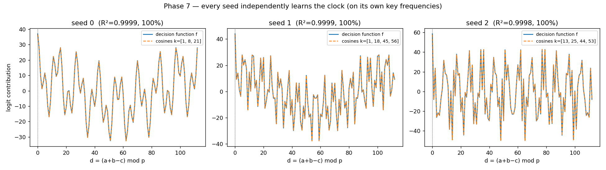
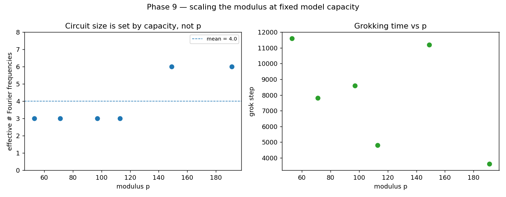

# Grokking, Reverse-Engineered

**Watch a transformer memorise modular arithmetic, suddenly generalise thousands of steps later — then open it up and find the exact trigonometric algorithm it taught itself.**

[](https://github.com/Punnag2307/grokking-interpretability/actions/workflows/ci.yml)


A one-layer transformer is trained on `(a + b) mod 113`. It memorises the training set
in a few hundred steps, then sits at **chance on held-out data for thousands of steps**
before *abruptly* generalising to 100% — the phenomenon known as **grokking**. This
project reproduces that, then reverse-engineers the network to show, with proof, *what*
it computes and *why* the jump looks sudden when it isn't.


> Train accuracy (blue) hits 100% almost immediately; test accuracy (orange) stays flat
> at chance for thousands of steps, then snaps to 100%. The question this project
> answers: **what is the network doing during that flat stretch, and what does it
> finally learn?**

## At a glance

| | |
|---|---|
| **The phenomenon** | memorises by step 200, groks at step ~4,800 — a **4,600-step delay** |
| **The mechanism** | its decision function *is* the closed form `Σₖ cos(ωₖ(a+b−c))`, recovered to **R² = 0.9999** |
| **Proven causally** | those 3 frequencies are **necessary, sufficient, and specific** (keep them → 100%, remove them → chance) |
| **Not actually sudden** | the circuit becomes dominant **~2,200 steps before** the loss ever moves |
| **What it needs** | **weight decay** (with none it never groks) and enough data |
| **Universal** | all 3 random seeds learn the *same* algorithm on *different* frequencies |
| **Scale-robust** | the clock reappears for every prime `p = 53–191`; circuit size (3–6 frequencies) is set by *capacity*, not `p` |
| **Engineering** | from-scratch, hookable model · **13/13 tests** · CI green · fully reproducible |

## Why this is interesting

Grokking is one of the rare places where "what is the model *actually* computing?" has a
checkable answer. The task's ground truth is known — it is modular addition — so every
mechanistic claim here is **falsifiable by intervention**: name the mechanism, delete it,
and watch accuracy collapse. The approach follows the interpretability programme of
Nanda et al. (2023): reverse-engineer the trained weights in a basis where the
computation becomes legible. Because the task lives on the cyclic group ℤ₁₁₃, that basis
is the **discrete Fourier transform**.

---

## The findings

### 1. It learns to think in a handful of frequencies

After grokking, the token embedding is **sparse in the Fourier basis**: 96% of its power
sits on just 3 frequencies (k = 1, 8, 21), where at initialisation the same power was
spread diffusely across all 56. A scale-free sparsity measure (the Gini coefficient of
the power spectrum) climbs **0.05 → 0.25 → 0.93** from init, through the plateau, to the
grokked model.


### 2. Those frequencies are a closed-form formula

The network's *decision function* — its logit as a function of `d = (a + b − c)` — is a
sum of cosines at exactly those key frequencies, recovered to **R² = 0.9999**, and it
peaks precisely at `d = 0`, i.e. at `c = a + b`. Stripped to nothing but that formula, it
still solves the task at **100%**. Trained only on examples and never shown a formula, the
transformer *became* one.

*(Reported honestly: this decision function accounts for ~66% of the raw logit variance;
the remainder is `c`-structure that does not change the prediction — stated, not hidden.)*


### 3. That formula is *causally* the whole computation

Correlation is not mechanism, so we intervene. Editing the embedding in Fourier space and
re-running the otherwise-untouched network:

- **keep only** the 3 key frequencies → accuracy stays **100%** (sufficient)
- **remove only** those 3 → accuracy collapses to **chance** (necessary)
- **remove any other** frequency → **no effect** (specific)


### 4. Grokking is gradual, not sudden

Replaying the saved trajectory, the key-frequency circuit becomes the **dominant
mechanism ~2,200 steps before** test accuracy moves, and embedding sparsity rises
monotonically all through the "flat" plateau. The sudden jump is the visible tip of a
continuous, three-phase process: **memorisation → circuit formation → cleanup** (the last
driven by weight decay).


### 5. What it depends on — and where it breaks

Sweeping the training recipe maps the boundaries. **Weight decay is essential**: with none
the model memorises forever and *never groks*; more of it groks sooner. There is a
**train-fraction threshold** below which it never groks. And subtraction — though
group-isomorphic to addition — groks **~5× slower**; isomorphic tasks need not share
training dynamics.


### 6. Every seed learns the same algorithm

A single reverse-engineered run could be a fluke, so we run the analysis on all three
seeds. Each independently learns the clock (cosine-fit **R² ≥ 0.9998**, 100%) — but on a
**different set of key frequencies**. The algorithm is universal; the frequencies it
lands on are seed-specific.



### 7. The circuit's size is set by capacity, not the modulus

Is the clock a quirk of `p = 113`? No. Training the same fixed-capacity model on six primes
from **53 to 191**, every one groks — and the effective number of Fourier frequencies stays
**small (3–6)** across a 3.6× range in `p`, nowhere near the ~`p/2` a problem-scaled circuit
would need. The circuit's size is set by the model's capacity, not by the problem.



---

## How it works

- **Task** — `(a op b) mod p` for prime `p = 113`, presented as tokens `[a, b, =]`; a
  fixed 30% of the `p²` pairs is training data, the rest held out.
- **Model** — a one-layer transformer (`d_model=128`, 4 heads, `d_mlp=512`), written
  **from scratch** with named weight matrices and an activation cache, no LayerNorm — so
  every activation is hookable and the learned circuit has a clean closed form.
- **Training** — full-batch AdamW, weight decay 1.0, seeded and bit-reproducible; the
  whole trajectory is checkpointed so the analysis can replay *when* the circuit forms.
- **Analysis** — the discrete Fourier basis over ℤ_p, with the analysis primitives
  unit-tested on a *synthetic* clock so a headline number can never be an artefact of the
  analysis code.

## Quick look

**[`notebooks/demo.ipynb`](notebooks/demo.ipynb)** trains a small transformer to grok and
reverse-engineers the clock circuit in **~2 minutes** — the whole project in miniature, runnable
on a clean clone.

## Reproduce it

Requires Python 3.11+ (a CUDA GPU is optional — it runs on CPU, only slower):

```bash
python -m venv .venv && . .venv/Scripts/activate   # Linux/macOS: . .venv/bin/activate
pip install -e ".[dev]"
make test          # the full suite (fast, CPU)
make reproduce     # retrain every seed and regenerate every figure (deterministic)
```

Or run any phase directly, e.g. `PYTHONPATH=src python experiments/phase3_circuit.py 0`.
The project was built in **gated phases**, each validated against an independent check
before the next began; the dated story, including the dead ends, is in the
[research log](RESEARCH_LOG.md).

## Repository layout

```
src/grok/       core library: config · seed · data · model (from-scratch transformer)
                · train · and the analysis primitives (fourier · circuit · analysis)
notebooks/      a ~2-minute runnable demo (demo.ipynb)
experiments/    one script per phase (1–9), each writing figures/tables to results/
results/        committed figures (PNG) and tables (MD) from real runs
tests/          correctness + reproducibility tests (incl. a synthetic-clock check)
paper/          the technical report (paper.md + built paper.pdf)
```

## Documentation

- **[paper/paper.pdf](paper/paper.pdf)** — the technical report (built with pandoc + LaTeX; source [paper.md](paper/paper.md), rebuilt with `make paper`).
- **[RESEARCH_LOG.md](RESEARCH_LOG.md)** — the dated narrative, including the dead ends and corrections.
- **[DECISIONS.md](DECISIONS.md)** — ADR-style record of the engineering choices.

## References

- Power et al. (2022), *Grokking: Generalization Beyond Overfitting on Small Algorithmic Datasets*.
- Nanda et al. (2023), *Progress Measures for Grokking via Mechanistic Interpretability*.
- Zhong et al. (2023), *The Clock and the Pizza: Two Stories in Mechanistic Explanation of Neural Networks*.

## License

MIT — see [LICENSE](LICENSE).
