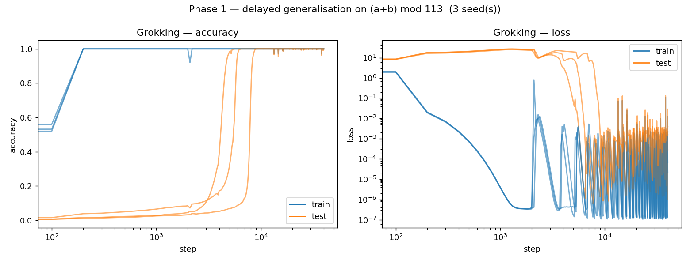
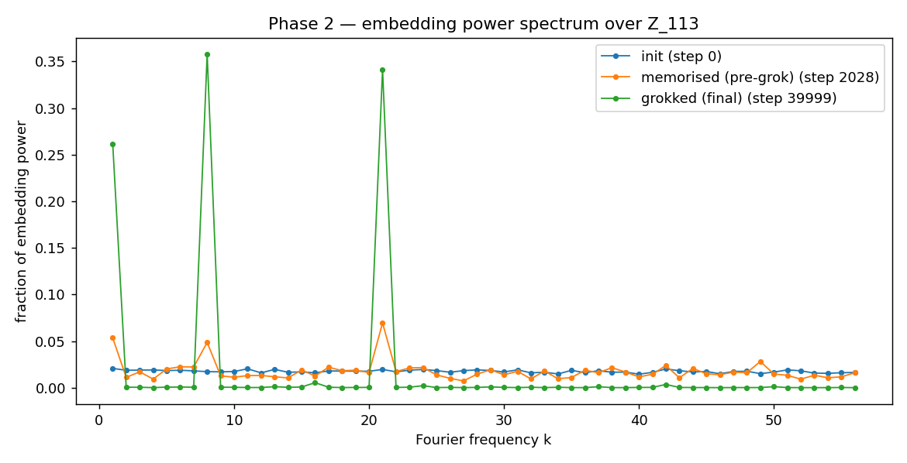
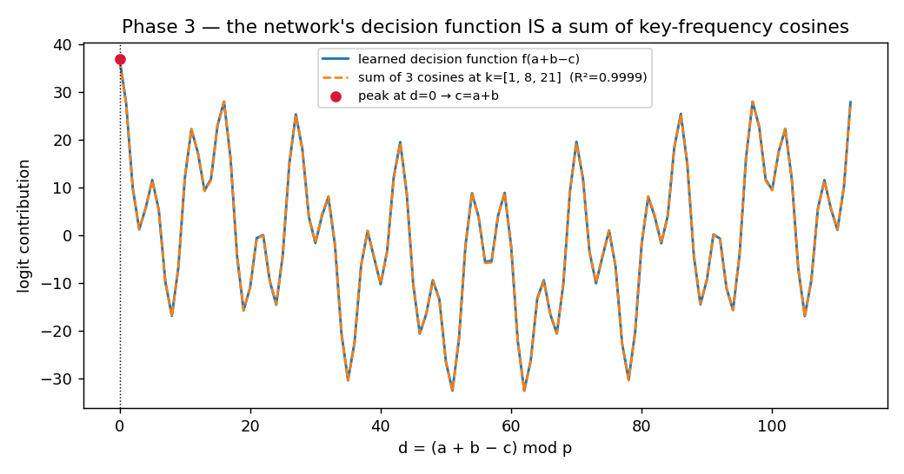
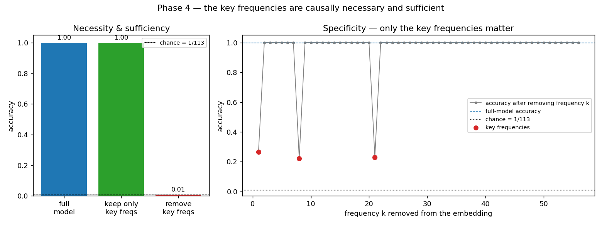
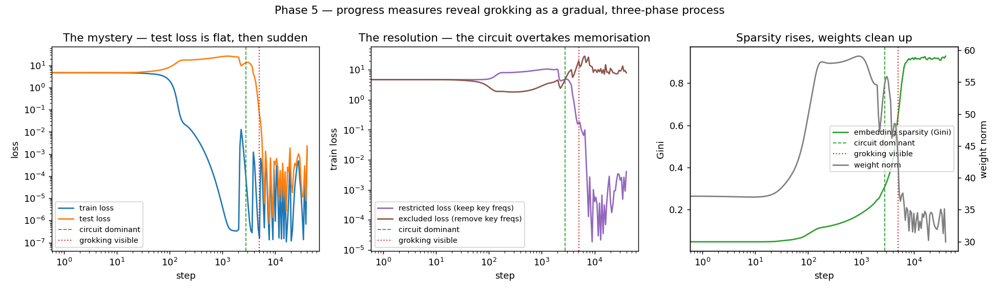
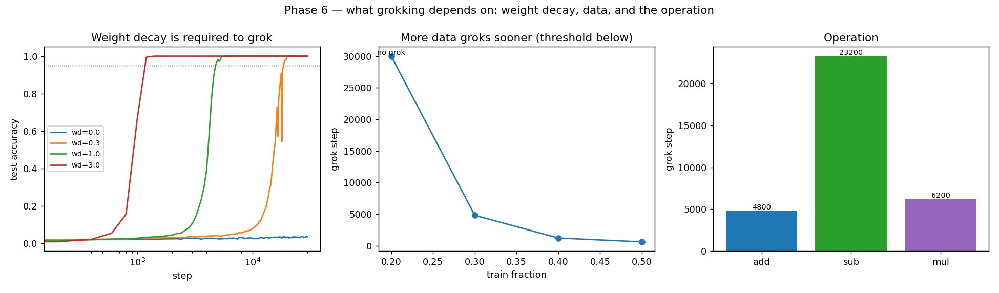

# Grokking, Reverse-Engineered — Mechanistic Interpretability of Delayed Generalisation

A from-scratch PyTorch study of **grokking**: a small transformer trained on
modular arithmetic memorises its training set almost immediately, then — tens of
thousands of steps later, long after the training loss has flatlined — *suddenly
generalises*. This project reproduces that phenomenon and then **opens the network
up** to show, mechanistically, *what* it learned and *why* the generalisation is
so abrupt.

The method is the one the field's best interpretability work uses (Nanda et al.,
2023): treat the trained weights as an object to be reverse-engineered, in a
basis where the computation is legible. Because the task lives on the cyclic group
ℤ_p, that basis is the **discrete Fourier basis** — and in it, the grokked network
turns out to be computing a small, exact trigonometric formula.

> **Status.** Built in gated phases, each validated before the next (the same
> discipline as its sibling project, DeepBSDE). Phases 0–2 are complete and shown
> below; Phases 3–8 are in progress — see [The plan](#the-plan).

## Headline (so far)

On `(a + b) mod 113`, a one-layer transformer:

- **groks** — memorises by step 200, but does not generalise until **step ~4,800**
  (a **4,600-step delay**), after which test accuracy is a flat **100%**; and
- learns to **think in a handful of frequencies** — the grokked token embedding
  concentrates **96% of its power on just 3 Fourier frequencies** (k = 1, 8, 21),
  whereas at initialisation the same power is spread diffusely across all 56.
  Fourier sparsity (Gini) rises **0.05 → 0.25 → 0.93** across the transition; and
- **computes a closed-form formula** — the network's decision function is a sum of
  cosines at exactly those 3 frequencies, `Σ_k cos(ω_k(a+b−c))`, recovered to
  **R² = 0.9999** and peaking exactly at `c = a+b`; stripped to nothing but that
  formula it still solves modular addition at **100%**; and
- **uses those 3 frequencies causally** — keeping *only* them in the embedding
  preserves **100%** accuracy (sufficient), removing *only* them drops accuracy to
  **chance** (necessary), and ablating any other frequency changes nothing (specific); and
- **grokked gradually, not suddenly** — replaying the trajectory, the key-frequency
  circuit becomes the dominant mechanism **~2,200 steps before** test accuracy moves,
  while embedding sparsity climbs monotonically through the "flat" plateau: a
  memorisation → circuit-formation → cleanup process; and
- **needs weight decay and enough data** — with **no weight decay it memorises forever
  and never groks** (and stronger decay groks sooner); below a train-fraction threshold
  it never groks; and even the isomorphic task `a−b` can grok ~5× slower than `a+b`; and
- **learns the same algorithm every time** — all three independently-trained seeds learn
  the clock (cosine-fit **R² ≥ 0.9998**, 100%), each on its *own* key frequencies: the
  algorithm is universal, the frequencies are seed-specific.



*Phase 1 — train (blue) hits 100% almost immediately; test (orange) stays at
chance for thousands of steps, then snaps to 100%.*



*Phase 2 — the grokked embedding (green) is sparse in the Fourier basis; the
random-init (blue) and memorised-but-not-grokked (orange) embeddings are not.*



*Phase 3 — the network's decision function (blue) is a sum of 3 cosines (orange
dashed, R² = 0.9999), peaking at `d = (a+b−c) = 0`. Trained only on examples, the
transformer has become a closed-form expression.*



*Phase 4 — keep only the 3 key frequencies in the embedding and accuracy stays
100% (sufficient); remove only them and it falls to chance (necessary); ablating
any other frequency does nothing (specific).*



*Phase 5 — the "sudden" jump (left) is the visible tip of a gradual reorganisation:
the key-frequency circuit overtakes memorisation (middle, crossover) and embedding
sparsity climbs (right) well before the test loss ever drops.*



*Phase 6 — what grokking depends on: weight decay is required (left; wd=0 never
groks), there is a train-fraction threshold (middle), and subtraction groks far
slower than addition despite being isomorphic (right).*

## Why grokking matters

Grokking is a clean, reproducible instance of a network generalising for reasons
invisible in its loss curve — so it is one of the few places where "what is the
model actually computing?" has a checkable answer. The task's ground truth is
*known* (it is modular addition), which makes every mechanistic claim falsifiable
by ablation: name the mechanism, delete it, and watch the accuracy collapse.

## The plan

| Phase | Scope | Validation | Status |
|------:|-------|------------|:------:|
| 0 | Scaffolding: config, seeding/determinism, from-scratch hookable transformer, task, full-batch trainer, tests, CI | 9/9 tests green; bit-reproducible | ✅ |
| 1 | Reproduce grokking | Multi-seed delayed-generalisation curve | ✅ |
| 2 | Fourier lens on the embedding | Sparsity (Gini) ≫ random; key frequencies identified | ✅ |
| 3 | The circuit ("clock"): decision fn = Σ cos(ωₖ(a+b−c)) | Cosine fit R² = 0.9999; formula alone classifies at 100% | ✅ |
| 4 | Causal verification | Keep-only 3 freqs → 100%; remove them → chance; specific | ✅ |
| 5 | Progress measures + three phases | Circuit dominant ~2,200 steps before grokking; sparsity rises through the plateau | ✅ |
| 6 | Ablations & where it breaks | wd=0 → never groks; train-fraction threshold; a−b groks ~5× slower than a+b | ✅ |
| 7 | The clock generalises across seeds | All 3 seeds learn the clock (R²≥0.9998, 100%) on *different* key frequencies | ✅ |
| 8 | Writeup: RESEARCH_LOG, DECISIONS, paper | Everything regenerable from a clean checkout | ▶ |

## Reproduce it

Requires Python 3.11+ and the pinned dependencies (`requirements.txt`); a CUDA
GPU is optional (runs on CPU, only slower).

```bash
python -m venv .venv && . .venv/Scripts/activate   # Linux/macOS: . .venv/bin/activate
pip install -e ".[dev]"
make test          # run the suite
make reproduce     # retrain all seeds and regenerate every figure (deterministic)
```

Or run a single phase directly, e.g. `PYTHONPATH=src python experiments/phase2_fourier.py 0`.

## Repository layout

```
src/grok/       core library: config, seed, data, model (from-scratch transformer),
                train, fourier, analysis
experiments/    one script per phase, writing figures/tables to results/
results/        committed figures (PNG) and tables (MD) from real runs
tests/          correctness + reproducibility tests
```

## References

- Power, Burda, Edwards, Babuschkin & Misra (2022), *Grokking: Generalization
  Beyond Overfitting on Small Algorithmic Datasets*.
- Nanda, Chan, Lieberum, Smith & Steinhardt (2023), *Progress measures for
  grokking via mechanistic interpretability*.
- Zhong, Liu, Tegmark & Andreas (2023), *The Clock and the Pizza: Two Stories in
  Mechanistic Explanation of Neural Networks*.

## License

MIT — see [LICENSE](LICENSE).
